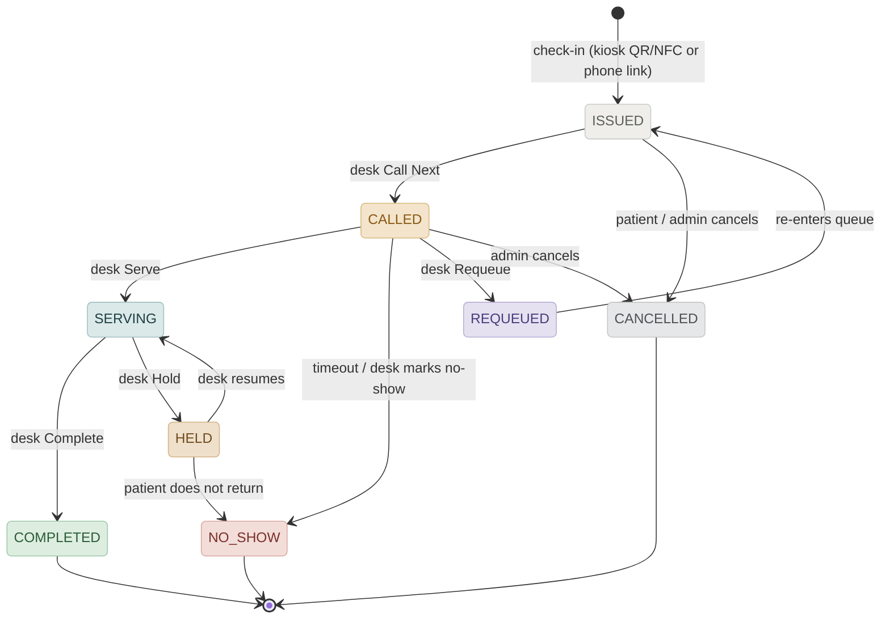
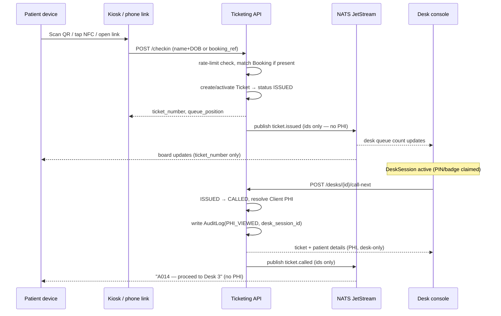

# Contactless Ticketing Module — Spec

Data schema, API surface, and real-time event contract for QR/NFC/link-based patient
check-in and desk-side queue management across multi-tenant clinic organizations.

**Status:** Draft v0.1 · **Date:** 2026-08-07 · **Stack:** Django · Next.js · iOS/Android · NATS JetStream

> This is the target-state design spec, written independently of the running codebase.
> See [`BLUEPRINT.md`](./BLUEPRINT.md) for how it reconciles with what's actually on disk
> (single `Clinic` model, demo-only auth, existing `AuditLog`) and the phased build order.

---

## 1. Decisions this spec is built on

Four architectural forks resolved before schema work started — each one changes what the
data model has to carry.

| Decision | Resolution | Why |
|---|---|---|
| **Tenancy** | Multi-tenant, separate orgs | Every table is scoped by `organization_id`. Isolation is enforced at the data layer, not just the API. |
| **Booking source** | Pre-booked + walk-in hybrid | `Ticket.booking_id` is nullable — phone-link check-in resolves an existing `Booking`, kiosk check-in creates a ticket with none. |
| **Desk identity** | Shared PIN / badge | A `DeskSession` tracks who's operating a `ServicePoint`, independent of staff login — staff rotate desks across a shift. |
| **Client view auth** | Public by ticket number | No PHI is ever in this surface, so status lookup is unauthenticated — rate-limited to block bulk enumeration. |

---

## 2. Data schema

Grouped by concern: tenancy & identity, scheduling, the live queue, and compliance.

### Tenancy & identity

**Organization**

| Field | Type | Notes |
|---|---|---|
| id | uuid | Primary key |
| name | string | |
| slug | string | Unique, used for subdomain / login routing |
| created_at | timestamp | |

**Location**

| Field | Type | Notes |
|---|---|---|
| id | uuid | Primary key |
| organization_id | fk → Organization | |
| name | string | |
| address | string | |
| timezone | string | IANA tz, for shift & report boundaries |

**Administrator (staff account)**

| Field | Type | Notes |
|---|---|---|
| id | uuid | Primary key |
| organization_id | fk → Organization | |
| name / email | string | |
| role | enum | `STAFF`, `DESK_OPERATOR`, `ADMIN`, `SUPER_ADMIN` |
| badge_id | string, hashed | Credential used to claim a `DeskSession` |
| password_hash / sso_subject | string | Admin dashboard login only — separate from desk auth |
| active | bool | |

**DeskSession**

| Field | Type | Notes |
|---|---|---|
| id | uuid | Primary key |
| service_point_id | fk → ServicePoint | |
| administrator_id | fk → Administrator | Who currently holds the desk |
| auth_method | enum | `PIN`, `BADGE` |
| started_at / ended_at | timestamp | `ended_at` null while active — this is the two-phase gate's source of truth |

**ThemeProfile**

| Field | Type | Notes |
|---|---|---|
| id | uuid | Primary key |
| organization_id | fk → Organization | Org-level default |
| location_id | fk → Location, nullable | Presence = override for that location; absence = inherit org default |
| brand_primary / brand_accent | color token | Validated server-side against WCAG AA (4.5:1) on both paper tokens before save — see [§8](#8-theming--white-labeling) |
| logo_asset_url | string | SVG/PNG, served from org-scoped storage |
| font_choice | enum | From an approved, pre-licensed list — not free text |
| density | enum | `COMFORTABLE`, `COMPACT` |
| corner_radius | enum | `SHARP`, `ROUNDED`, `PILL` |
| updated_at | timestamp | |

### Scheduling

**Client / Patient**

| Field | Type | Notes |
|---|---|---|
| id | uuid | Primary key |
| organization_id | fk → Organization | |
| first_name / last_name | string, encrypted | PHI — field-level encryption at rest |
| date_of_birth | date, encrypted | PHI — used as check-in match key |
| phone | string, encrypted | PHI — optional |

**Service**

| Field | Type | Notes |
|---|---|---|
| id | uuid | Primary key |
| location_id | fk → Location | |
| name / code | string | |
| default_priority | int | Baseline queue weight |
| estimated_duration_minutes | int | Feeds wait-time estimates |
| active | bool | |

**Booking**

| Field | Type | Notes |
|---|---|---|
| id | uuid | Primary key |
| client_id | fk → Client | |
| service_id | fk → Service | |
| booking_ref | string | Unique per org — the code patients enter for link check-in |
| scheduled_at | timestamp, nullable | |
| status | enum | `SCHEDULED`, `CHECKED_IN`, `CANCELLED`, `EXPIRED` |
| source | enum | `EXTERNAL_SYSTEM`, `PHONE`, `WEB`, `ADMIN` |

### Queue

**ServicePoint (desk)**

| Field | Type | Notes |
|---|---|---|
| id | uuid | Primary key |
| location_id | fk → Location | |
| name | string | e.g. "Desk 3" |
| pin_hash | string, hashed | Shared desk credential, independent of badge |
| status | enum | `OFFLINE`, `IDLE`, `BUSY`, `PAUSED` |
| services_supported | m2m → Service | Which service types route here |

**Ticket**

| Field | Type | Notes |
|---|---|---|
| id | uuid | Primary key — internal only, never shown |
| ticket_number | string | Short, human-readable, scoped per location per day (e.g. `A014`) — not globally sequential, to avoid leaking clinic volume |
| organization_id / location_id | fk | |
| booking_id | fk → Booking, nullable | Null for pure walk-ins |
| client_id | fk → Client, nullable | May resolve at check-in (link) or later at desk (anonymous kiosk walk-in) |
| service_id | fk → Service | |
| status | enum | See [state machine](#3-ticket-state-machine) |
| priority | int | Inherited from Service, admin-overridable |
| check_in_method | enum | `KIOSK_QR`, `KIOSK_NFC`, `PHONE_LINK` |
| service_point_id | fk → ServicePoint, nullable | Set once called |
| desk_session_id | fk → DeskSession, nullable | Which session called it — audit trail anchor |
| requeue_count | int | |
| issued_at / called_at / serving_started_at / completed_at | timestamp, nullable | Drives reporting & wait-time metrics |

### Compliance

**AuditLog**

| Field | Type | Notes |
|---|---|---|
| id | uuid | Primary key |
| desk_session_id | fk → DeskSession, nullable | Null for admin-surface actions |
| administrator_id | fk → Administrator | |
| ticket_id / client_id | fk, nullable | |
| action | enum | `PHI_VIEWED`, `TICKET_CALLED`, `TICKET_COMPLETED`, … |
| occurred_at | timestamp | |

**RoutingRule**

| Field | Type | Notes |
|---|---|---|
| id | uuid | Primary key |
| location_id / service_id | fk | |
| priority_modifier | int | Added to a ticket's base priority |
| conditions | jsonb | e.g. VIP flag, urgent flag, wait-time threshold |
| active | bool | |

---

## 3. Ticket state machine

`ISSUED` → `CALLED` → `SERVING` → `COMPLETED`, plus branches for `NO_SHOW`, `CANCELLED`,
`REQUEUED`. `HELD` was added to back the desk console's "Hold" action from the original
brief — flagged in [§10](#10-assumptions--open-items).



---

## 4. Check-in & two-phase call flow

The gate: a ticket carries no visible PHI until a desk with an active `DeskSession` calls
it. Everything upstream of that — issuing, board updates, client-facing status — moves on
ticket number and IDs only.



---

## 5. API endpoints

Grouped by surface. Public endpoints are rate-limited by IP/device; desk endpoints require
an active `DeskSession`; admin endpoints require an `Administrator` session scoped to the
organization.

### Public — unauthenticated, rate-limited

| Method | Path | Purpose |
|---|---|---|
| POST | `/v1/checkin/kiosk` | Walk-in via QR/NFC → creates Ticket, no Booking |
| POST | `/v1/checkin/link` | Name+DOB or booking_ref match → resolves Booking, activates Ticket |
| GET | `/v1/tickets/{ticket_number}/status` | Status, queue position, estimated wait — no PHI |
| GET | `/v1/locations/{id}/board` | Shared-display feed of currently-called tickets |
| GET | `/v1/branding?location_id=` | Effective theme tokens (org default merged with location override) — fetched by console, kiosk, and native at boot |

### Desk console — DeskSession-scoped

| Method | Path | Purpose |
|---|---|---|
| POST | `/v1/desks/{sp_id}/session` | Claim desk via PIN/badge → opens DeskSession |
| DELETE | `/v1/desks/{sp_id}/session` | Release desk / end shift |
| POST | `/v1/desks/{sp_id}/call-next` | ISSUED → CALLED, opens PHI, writes AuditLog |
| GET | `/v1/tickets/{id}` | PHI included — only if ticket is bound to caller's desk |
| POST | `/v1/tickets/{id}/serve` | CALLED → SERVING |
| POST | `/v1/tickets/{id}/complete` | SERVING → COMPLETED |
| POST | `/v1/tickets/{id}/no-show` | CALLED / HELD → NO_SHOW |
| POST | `/v1/tickets/{id}/requeue` | CALLED → REQUEUED → ISSUED |
| POST | `/v1/tickets/{id}/hold` | SERVING → HELD |
| POST | `/v1/tickets/{id}/resume` | HELD → SERVING |

### Admin dashboard — Administrator-scoped, role ≥ ADMIN

| Method | Path | Purpose |
|---|---|---|
| GET | `/v1/admin/floor` | Live view — all tickets/desks at a location |
| POST | `/v1/admin/tickets/{id}/priority-override` | |
| POST | `/v1/admin/tickets/{id}/cancel` | |
| POST | `/v1/admin/tickets/{id}/reassign` | Force-move to another desk |
| POST | `/v1/admin/branding` | Set org or location theme tokens — rejects colors that fail contrast validation |
| | + standard CRUD under `/v1/admin/{locations, service-points, services, staff, routing-rules}` | |
| GET | `/v1/admin/reports/wait-times` | |
| GET | `/v1/admin/audit-log` | PHI access trail |
| POST | `/v1/admin/escalations` | Trigger escalation workflow |

### Auth

| Method | Path | Purpose |
|---|---|---|
| POST | `/v1/auth/login` | Administrator login, org-scoped (password or SSO) |
| POST | `/v1/auth/desk-pin` | Alias of desk-session claim, for terminal-level auth flows |

---

## 6. Event contract — NATS JetStream

Subject: `clinic.{organization_id}.{location_id}.ticket.*` and `…desk.*`. **PHI never
touches the event bus** — payloads carry IDs and ticket_number only; desk/admin
subscribers fetch PHI via the authenticated REST calls above, not from the event itself.

| Event | Fires on | Consumed by |
|---|---|---|
| `ticket.issued` | Check-in success | Client board, desk console |
| `ticket.called` | ISSUED → CALLED | Client board, desk console |
| `ticket.serving` | CALLED → SERVING | Desk console, admin |
| `ticket.completed` | SERVING → COMPLETED | All three |
| `ticket.no_show` | → NO_SHOW | Desk console, admin |
| `ticket.cancelled` | → CANCELLED | All three |
| `ticket.requeued` | CALLED → REQUEUED | Client board, desk console |
| `ticket.held` / `ticket.resumed` | SERVING ⇄ HELD | Desk console, admin |
| `desk.status_changed` | DeskSession claimed/released, status change | Admin, desk console |

**Payload envelope:**

```json
{
  "event_id": "evt_01J...",
  "event_type": "ticket.called",
  "occurred_at": "2026-08-07T14:32:05Z",
  "organization_id": "org_...",
  "location_id": "loc_...",
  "data": {
    "ticket_id": "tkt_...",
    "ticket_number": "A014",
    "status": "CALLED",
    "previous_status": "ISSUED",
    "service_id": "svc_...",
    "service_point_id": "sp_003"
  }
}
```

**Real-time subscribers:**

| Gateway | Auth | Scope |
|---|---|---|
| `/ws/client/{location_id}/board` | None | Scrubbed board events for that location only |
| `/ws/desk/{service_point_id}` | DeskSession | That desk's queue + assigned ticket events |
| `/ws/admin/{location_id}` | Administrator | Full event stream for the location |

---

## 7. Security & HIPAA notes

- Ticket numbers only appear on shared displays and the public board — never name, DOB, or reason for visit.
- Every desk-side PHI view writes an `AuditLog` row tied to the active `DeskSession`, not just the staff login — so audits reflect who was physically at the desk.
- Phone-link check-in (name+DOB match) is rate-limited and locks out after repeated failures, to prevent identity-probing.
- Public status/board endpoints are rate-limited per IP/device — no PHI is exposed there, but bulk enumeration could still leak clinic volume patterns.
- Tenant isolation (`organization_id`) is enforced at the data layer — row-level, not just filtered at the API — so a query bug can't cross a tenant boundary.
- Event payloads on NATS never carry PHI, even for authenticated subscribers — desk/admin clients fetch patient detail via authenticated REST, keeping the bus itself HIPAA-light.

---

## 8. Theming & white-labeling

Tenant-customizable, but through a locked set of semantic tokens — not open CSS access.
Two surfaces depend on colors meaning something reliably: the state-color system (CALLED
vs NO_SHOW has to stay legible from across a waiting room) and the public kiosk/board,
which needs guaranteed contrast regardless of who's branding it. Tenants pick within a
validated range; they don't touch the component library.

### What's themeable vs. locked

| Themeable (per Organization, override per Location) | Locked (platform-wide) |
|---|---|
| Brand primary / accent color | Ticket state-color palette (ISSUED/CALLED/SERVING/…) |
| Logo asset | Minimum contrast ratio (WCAG AA, 4.5:1) — enforced server-side on save |
| Font choice, from an approved list | Font files — no arbitrary uploads, licensing + kiosk/native rendering both constrain this |
| Density (comfortable / compact) | The two-phase PHI-gate UI pattern itself |
| Corner radius (sharp / rounded / pill) | Light/dark mode token structure (theming is an axis on top of it, not a replacement) |

### Delivery

One token payload, one source of truth, three renderers:

- Next.js desk console and admin dashboard fetch `GET /v1/branding` once per session and inject the result as CSS custom properties on the root.
- The kiosk / client board (public, unauthenticated) resolves branding the same way, scoped by `location_id`.
- iOS/Android map the same payload to their native color-asset catalogs and font tables at launch — no separate theming logic per platform.

### Token contract

```json
{
  "organization_id": "org_...",
  "location_id": "loc_...",
  "brand": {
    "primary": "#2F5D62",
    "accent": "#3C7A4D",
    "logo_url": "https://assets.clinic-os.io/org_.../logo.svg"
  },
  "typography": {
    "font": "editorial-serif"
  },
  "density": "COMFORTABLE",
  "corner_radius": "ROUNDED"
}
```

On `POST /v1/admin/branding`, submitted colors are checked against both the light and dark
paper tokens at 4.5:1 before they're accepted — a color that fails is rejected with the
nearest compliant value suggested, not silently clamped.

---

## 9. Roadmap: AI-augmented operations

A layer on top of the API and event surface already defined above — not a redesign. Every
capability here reads or writes through the same `DeskSession` / `Administrator` auth and
the same `AuditLog` as a human using the console. **RAG is intentionally left out**: this
system is transactional, not document-heavy, and there's no real knowledge corpus yet to
ground it in — revisit only if an org-policy / compliance knowledge base gets built later.

### MCP — wraps the existing API, no separate integration path

Expose the admin and desk endpoints already in this spec as MCP tools rather than building
a bespoke chat integration. An ops copilot calls `call-next`, `reassign`,
`reports/wait-times`, `escalations` the same way the Next.js console does.

| MCP tool | Wraps | Auth boundary |
|---|---|---|
| `reassign_ticket` | `POST /v1/admin/tickets/{id}/reassign` | Administrator session — same as console |
| `call_next` | `POST /v1/desks/{sp_id}/call-next` | Active DeskSession — writes `PHI_VIEWED` AuditLog same as a human tap |
| `get_wait_times` | `GET /v1/admin/reports/wait-times` | Administrator session, non-PHI aggregate |
| `trigger_escalation` | `POST /v1/admin/escalations` | Administrator session |

### Agentic AI — human-in-the-loop by default

A queue-balancing agent subscribed to the NATS stream (`ticket.issued`,
`desk.status_changed`) can notice imbalance — Desk 4 idle while Desk 2 has six tickets
queued — and propose a reassignment or escalation. Given clinical stakes, this starts as a
suggestion queue an admin approves, not autonomous action; specific low-risk actions can
graduate to auto-execute once the suggestion accuracy is trusted in production.

### LLM — intake classification and natural-language reporting

- **Intake:** a patient's free-text reason for visit maps to a `Service` + `RoutingRule` match at check-in, instead of a rigid dropdown.
- **Reporting:** admins ask natural-language questions over `Ticket` / `AuditLog` aggregates ("why did wait times spike Tuesday afternoon") instead of every question needing bespoke report UI.

### The governing constraint

- **PHI boundary applies to AI the same as it applies to everything else in this spec.** Any component that touches `Client` PHI (name, DOB) needs a BAA-covered model deployment and must respect the two-phase gate — it cannot be sent to a general-purpose LLM API without that coverage.
- **Non-PHI-scoped capabilities can proceed independently of that dependency** — routing suggestions, the reassignment agent, and aggregate reporting all operate on ticket numbers, timestamps, and routing config, not patient identity.

---

## 10. Assumptions & open items

- **Location-per-org assumed.** "Multi-tenant" was resolved as separate orgs; whether each org has one location or several wasn't asked directly — this spec assumes several. Flag if it should be one.
- **`HELD` state added** beyond the original ISSUED/CALLED/SERVING/COMPLETED + NO_SHOW/CANCELLED/REQUEUED list, to back the desk console's "Hold" action mentioned in the brief. Confirm the transition rules above match intent.
- **AuditLog retention period unset.** No policy was specified — needs a compliance-confirmed retention window before this ships.
- **Rate-limit thresholds are placeholders** (check-in match attempts, board/status polling) — proposed, not confirmed requirements.
- **Ticket number format** proposed as short + per-location-per-day scoped (e.g. `A014`) rather than globally sequential, specifically to avoid volume leakage on the public board — worth confirming against whatever the kiosk hardware / printer can render.
- **Approved font list for `ThemeProfile.font_choice` is undefined.** Needs a short vetted set that's licensed for embedding across web, kiosk, and native, and renders legibly at kiosk viewing distance — not just "whatever's on Google Fonts."
- **AI roadmap section is directional, not implementation-ready.** No entities/endpoints defined yet for MCP tool registration, agent-suggestion approval queues, or model/BAA vendor selection — needed before any of it moves past design.

---

*Contactless Ticketing Module — draft spec for clinic-os. Schema and endpoints above are
the basis for the Django models / DRF views and Next.js console work in
[`BLUEPRINT.md`](./BLUEPRINT.md).*
